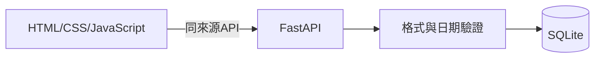

# 04 SAD — 最小架構

```mermaid
flowchart LR
    B[HTML/CSS/JavaScript] -->|同來源API| A[FastAPI]
    A --> V[格式與日期驗證]
    V --> D[(SQLite)]
```
前端顯示、後端驗證與存檔、rules算天數。資料庫接縫由create_app(database_path)注入。
沿用STACK，沒有額外技術選型。API錯誤不新增資料；畫面保留錯誤訊息。
